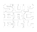

  

Custom Blender glTF Importer and Exporter extension
======================================

> [!IMPORTANT]
> This material is unofficial and is not endorsed by Supercell. For more information see Supercell's Fan Content Policy: www.supercell.com/fan-content-policy.

Introduction
------------
Custom extension for Official Khronos Group Blender [glTF](https://www.khronos.org/gltf/) 2.0 importer and exporter

The goal of this project is to add support for Supercell glTF files to Blender using features of official Blender glTF importer
Essentially, it is a reimagined version of [Flat Converter](https://github.com/Daniil-SV/Supercell-Flat-Converter), but more convenient and accessible

Installation
------------
WIP

What is currently supported
------------
Currently, basic file import and mesh import are supported
TODO: Animations and shaders import